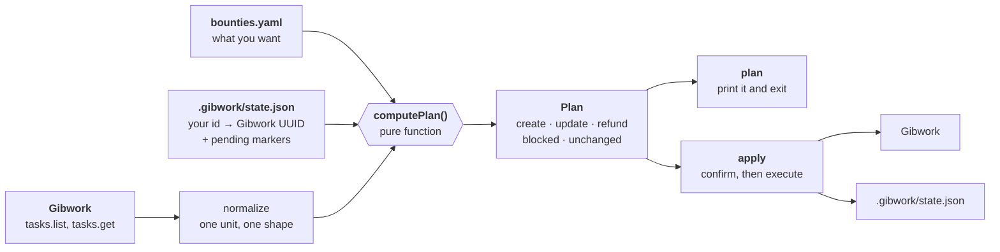
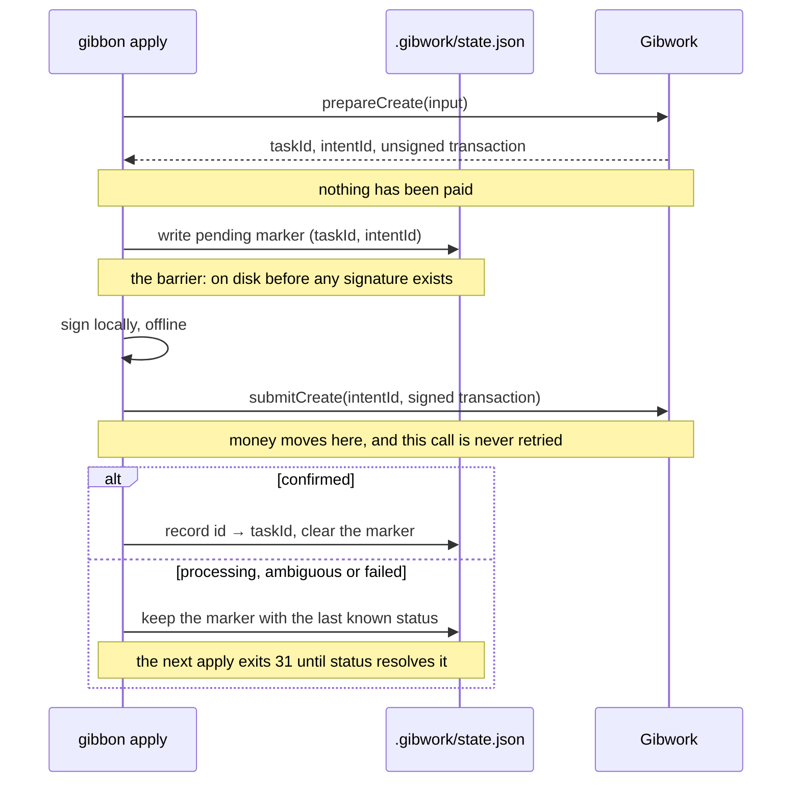

# Gibbon

**Bounties as code for Gibwork.**

Keep your bounty backlog in one YAML file, preview every change, and never pay twice.

**[Quick start](#quick-start)**  ·  **[How it works](#how-it-works)**  ·  **[Architecture](#architecture)**  ·  **[Reference](#reference)**  ·  **[Landing page](https://gibbon-site.vercel.app)**

---

Gibbon is for open source projects and protocols that want to fund their issue
backlog on [Gibwork](https://gib.work).

If your core is open source, you probably have a list of issues you would pay
to get fixed. Gibbon turns that list into funded bounties, keeps it current as
issues get resolved, and does it with more than one maintainer involved.

You keep the bounties you want funded in a `bounties.yaml` file next to your
code. One command shows what would change on Gibwork. A second makes it happen.

```bash
$ gibbon plan --profile stage

  + create   docs-cli         1.00
  ~ update   fix-142          content  (3f9c8a21)
  - refund   old-audit        Old audit  (7b2e1f04)
  ! blocked  perf-bench       (9c04ab13)
             amount cannot be changed on a live bounty. Refund this bounty and
             create a replacement, or revert the file.

Plan: 1 to create, 1 to update, 1 to refund, 1 blocked.
```

Nothing happened there. That was a preview. `gibbon apply` does it.

Gibbon is a terminal tool built on the [Gibwork SDK](https://www.npmjs.com/package/@gibwork/sdk).
There is no web app and no dashboard.

## Contents

- [Why Gibbon](#why-gibbon)
- [What works today](#what-works-today)
- [How it works](#how-it-works)
- [Quick start](#quick-start)
- [What a normal Friday looks like](#what-a-normal-friday-looks-like)
- [But Gibwork already has an AI agent for this](#but-gibwork-already-has-an-ai-agent-for-this)
- [Already have bounties? Use import](#already-have-bounties-use-import)
- [Writing the file with AI](#writing-the-file-with-ai)
- [Architecture](#architecture)
- [Reference](#reference)
- [What this uses from Gibwork](#what-this-uses-from-gibwork)
- [Using it in CI](#using-it-in-ci)
- [Development](#development)
- [Where this could go](#where-this-could-go)
- [Demo](#demo)

---


## Why Gibbon

Say you run bounties for your open source project, and ten are live. Today you
manage them one at a time: to edit one, you list them all, find it, copy its
UUID, and paste it into an update command. To close three, you do that three
more times.

An AI agent can do the typing, so typing is not the real problem. These four
things are:


|     | The problem                                                                                                                                                                                                                                                                             | What Gibbon does about it                                                                                              |
| --- | --------------------------------------------------------------------------------------------------------------------------------------------------------------------------------------------------------------------------------------------------------------------------------------- | ---------------------------------------------------------------------------------------------------------------------- |
| 1   | **You cannot see what is about to happen.** There is no preview. You run a command and find out afterwards.                                                                                                                                                                             | `gibbon plan` prints every create, update and refund first, and changes nothing.                                       |
| 2   | **Running the same thing twice creates duplicates.** Ask an agent twice for "two bounties for the parser bugs" and you get four bounties and a bill for four.                                                                                                                           | A list of instructions repeats. A file does not. The second `apply` says `No changes.`                                 |
| 3   | **Nothing records what you meant, only what currently exists.** Six weeks later you cannot tell who raised a reward from 1 to 5, when, or why, or whether someone edited a bounty in the mobile app.                                                                                    | The bounty list is a file in git. `git log -p bounties.yaml` is the audit trail and a pull request is the review.      |
| 4   | **If a bounty creation gets interrupted, you are stuck.** Creating a bounty sends a real Solana transaction. If your laptop sleeps halfway through, you cannot tell whether the money moved, and Gibwork's task creation has no idempotency key, so trying again funds a second bounty. | The new bounty's UUID reaches disk before anything is signed, so `gibbon status` can ask Gibwork what really happened. |


Gibbon fixes all four by making the bounty list a file in git, previewing every
change, and never letting anything except a reviewed diff move money.

If your reaction is *"Gibwork already has an AI agent that can do all this"*,
that is the right question. [There is a section on it below](#but-gibwork-already-has-an-ai-agent-for-this)
with four things you can try yourself.

## What works today


| Capability                                                 | Status                                 |
| ---------------------------------------------------------- | -------------------------------------- |
| `plan`: read-only preview of every change                  | Run against the live Gibwork stage API |
| `apply`: create, update and refund, with the crash barrier | Run against the live Gibwork stage API |
| `import`: build the file from bounties you already posted  | Run against the live Gibwork stage API |
| `status`: resolve an interrupted `apply`                   | Run against the live Gibwork stage API |
| `agent`: rewrite the file from a plain English request     | Working. Needs an Anthropic API key    |
| `--json` output and exit codes matching the official CLI   | Working                                |
| Automated tests                                            | 92, none of which touch the network    |


---


## How it works

Three things get compared every time you run `plan`:


|               | what it is                               | where it lives        |
| ------------- | ---------------------------------------- | --------------------- |
| what you want | your bounty list                         | `bounties.yaml`       |
| what you made | a map from your names to Gibwork's UUIDs | `.gibwork/state.json` |
| what exists   | your live bounties                       | Gibwork               |


The middle one is why you never type a UUID. You call a bounty `fix-142`,
Gibwork calls it `3f9c8a21-...`, and Gibbon remembers which is which.


| command  | what it does                                                      | costs money          |
| -------- | ----------------------------------------------------------------- | -------------------- |
| `import` | Read your existing bounties and write the file for you. Run once. | no                   |
| `plan`   | Show what would change. Changes nothing.                          | no                   |
| `apply`  | Make the changes.                                                 | **yes**              |
| `status` | Clean up after an interrupted `apply`.                            | no                   |
| `agent`  | Rewrite the file from a plain English request.                    | no (needs an AI key) |


For how the code does this, see [Architecture](#architecture).

---


## Quick start


### Install

You need Node.js 22 or newer and [Bun](https://bun.sh) to build.

```bash
git clone https://github.com/Shiva953/gibwork-sync
cd gibwork-sync
bun install && bun run build
alias gibbon="node $PWD/dist/index.js"
```

Or install the `gibbon` command globally, straight from GitHub:

```bash
npm i -g github:Shiva953/gibwork-sync
```


### Set up your wallet

If you already use the official Gibwork CLI, **you are done.** Gibbon reads the
same config file. Just pass `--profile`:

```bash
gibbon plan --profile stage
```

Otherwise set one of these, or pass `--keypair <path>` directly:


| variable                                  | what it does                                   |
| ----------------------------------------- | ---------------------------------------------- |
| `GIBWORK_KEYPAIR_PATH`                    | path to a Solana keypair JSON file (preferred) |
| `GIBWORK_PRIVATE_KEY`                     | the key itself, base58 or a JSON byte array    |
| `GIBWORK_PROFILE` / `GIBWORK_ENVIRONMENT` | profile to use · `stage` or `production`       |
| `ANTHROPIC_API_KEY`                       | only needed for `gibbon agent`                 |


Three rules Gibbon follows: a private key is **never** accepted as a command
line argument, because arguments leak into shell history and `ps`; `.env` is
never read on its own (use `node --env-file=.env`); and setting both key
variables is an error, not a guess, because you should never be unsure which
wallet signed.

> [!WARNING]
> **Stage is not free.** Gibwork's `stage` environment keeps test bounties out
> of the main marketplace, but settles in **real mainnet USDC**. The minimum
> bounty is 1.00 USDC. Creating is fee free and refunding costs about 0.01
> USDC, so a create and refund cycle costs about a cent.


### Your first bounty

Create `bounties.yaml`:

```yaml
- id: proxy-env
  title: "Respect the HTTPS_PROXY variable"
  content: "<p>A reused session ignores HTTPS_PROXY. See issue #142.</p>"
  tags: [bug, python]
  amount: "1.00"
  minSubmission: "1.00"
```

Then preview and apply:

```
$ gibbon plan --profile stage
wallet 9K1Zp3wokoer3AVVTExhJkoudkfKSD939xGBJ4u6cx2h  ·  stage  ·  credentials from profile keypair

  + create   proxy-env        1.00

Plan: 1 to create, 0 to update, 0 to refund.

$ gibbon apply --profile stage
  + create   proxy-env        1.00
Apply these changes to stage? [y/N] y

  created proxy-env -> fcfb7a61-edd5-42f7-ad2e-59ae229bbac9

Applied: 1 created, 0 updated, 0 refunded.
```

Your bounty is live, and Gibbon wrote down which UUID it got:

```bash
$ cat .gibwork/state.json
{
  "version": 1,
  "wallet": "9K1Zp3wokoer3AVVTExhJkoudkfKSD939xGBJ4u6cx2h",
  "environment": "stage",
  "tasks": {
    "proxy-env": {
      "taskId": "fcfb7a61-edd5-42f7-ad2e-59ae229bbac9",
      "lastAppliedHash": "2011b853086adb6c",
      "lastSyncedAt": "2026-09-18T10:42:22.519Z"
    }
  },
  "pending": []
}
```

> [!IMPORTANT]
> Keep that file. It is the only thing connecting `proxy-env` to that UUID.
> Delete it and Gibbon forgets the bounty exists, with your money still in
> escrow.

For one bounty the official CLI is just as good: `gibwork task create` with six
flags is the same length as the YAML. The difference starts at the second
bounty, and at the second time you run anything.

---


## What a normal Friday looks like

You have five bounties live. One got fixed upstream, two need clearer
descriptions, and a new bug needs funding.

### With the official CLI

First find out what you have, then copy a UUID out of the list for each change:

```
$ gibwork task list --profile stage --limit 5
ID                                    STATUS       OPEN   TITLE
fcfb7a61-edd5-42f7-ad2e-59ae229bbac9  in progress  true   Connection leak on streamed responses
7b2e1f04-9c31-4a8d-b6e2-1f0a5c8d3e44  in progress  true   Rewrite the quickstart guide
3d5f8a10-4b2c-49e7-8f31-0c7a9e6b2d55  in progress  true   Clearer timeout error messages
9c04ab13-2e77-4b10-a3f5-6d8e0b2c1a99  in progress  true   Jittered retry backoff
b8e07c94-1a6d-4f52-9e88-2c4b7d0a3f61  in progress  true   Persist the cookie jar across sessions

$ gibwork task refund fcfb7a61-edd5-42f7-ad2e-59ae229bbac9 --profile stage
$ gibwork task update 7b2e1f04-9c31-4a8d-b6e2-1f0a5c8d3e44 --profile stage --content-file docs.html
$ gibwork task update 3d5f8a10-4b2c-49e7-8f31-0c7a9e6b2d55 --profile stage --content-file timeout.html
$ gibwork task create --profile stage \
    --title "HTTP/2 ALPN negotiation fails on macOS" \
    --content-file alpn.html --tag bug --tag macos \
    --amount 1.00 --min-submission 1.00
```

Four commands, four confirmations, **three UUIDs copied by hand**, and no
preview.
Paste the wrong UUID into a refund and you close a bounty somebody is actively
working on. Nothing warns you.

### With Gibbon

Edit one file: delete one entry, change two `content:` lines, add one.

```diff
$ git diff bounties.yaml
-- id: stream-leak
-  title: "Connection leak on streamed responses"
-  content: "<p>Streamed responses never release their socket.</p>"
-  tags: [bug, python]
-  amount: "1.00"
-
 - id: docs-quickstart
-  content: "<p>The quickstart is out of date.</p>"
+  content: "<p>The quickstart is out of date. Cover install, first request and auth.</p>"
+
+- id: http2-alpn
+  title: "HTTP/2 ALPN negotiation fails on macOS"
+  content: "<p>ALPN falls back to HTTP/1.1 on macOS only. See #211.</p>"
+  tags: [bug, macos]
+  amount: "1.00"
```

```
$ gibbon plan --profile stage
  + create   http2-alpn       1.00
  ~ update   docs-quickstart  content  (7b2e1f04)
  ~ update   timeout-msg      content  (3d5f8a10)
  - refund   stream-leak      Connection leak on streamed responses  (fcfb7a61)
    2 unchanged

Plan: 1 to create, 2 to update, 1 to refund.

$ gibbon apply --profile stage
Apply these changes to stage? [y/N] y
```

**One screen showing everything that will happen, before any of it happens.**
One confirmation instead of four. No UUID typed at any point. The short hashes
in brackets are output you can cross-check, not input you have to get right.
And because it is a `git diff`, a teammate can review a bounty change in a pull
request before it spends money.

**The part that is not about convenience:** run the CLI block twice and you get
a second "HTTP/2 ALPN negotiation fails on macOS" bounty and another 1.00 USDC
gone.
Run `apply` twice and the second run prints:

```
    5 unchanged

No changes. bounties.yaml matches live Gibwork state.
```

A command is an instruction, so it runs every time. A file describes how things
should be, so running it twice is the same as running it once.

---


## But Gibwork already has an AI agent for this

It does, and for a single bounty it is better than this. `gibwork skills install claude` lets you say "create a bounty for the parser leak at 1 USDC"
and it happens. It finds UUIDs by title and writes the flags for you, so any
claim this tool made about saving keystrokes would be nonsense.

Here are four situations where it is not about keystrokes. You can run every
one yourself.

### 1. Doing the same thing twice

Tell the agent on Monday to post a bounty for the parser leak, forget, and ask
again on Friday: you get two bounties, 2 USDC locked, and no warning. Run
`apply` twice and the second run says `No changes.` Sixty seconds and 2 USDC to
check for yourself, and the clearest of the four.

### 2. Asking whether anything changed without you

Someone on your team edits a bounty description in the Gibwork mobile app. The
agent can read you the current description, but not tell you it *changed*,
because nothing on your machine records what it was supposed to say. `plan`
shows it as an update, free and read-only, and `git log -p bounties.yaml` says
when the file last changed, by whom, and why.

### 3. Raising a reward

*Raise the parser bounty to 5 USDC.* Gibwork does not allow this: a live
bounty's amount is permanent. Only the description, deadline and
verified-only setting can change. The agent either fails partway or improvises
a refund and recreate, which is two transactions you did not ask for. The
official CLI just says:

```
$ gibwork task update bb24ca91-1b4f-4d91-8fa3-fed2501972f4 --profile stage --amount 5.00
error: unknown option '--amount'
```

That tells you a flag is missing, not that the field is permanent or what to do
instead. With the file, change `amount: "1.00"` to `"5.00"`:

```
$ gibbon plan --profile stage
  ! blocked  parser-leak      (bb24ca91)
             amount cannot be changed on a live bounty. Refund this bounty and
             create a replacement, or revert the file.

Plan: 0 to create, 0 to update, 0 to refund, 1 blocked.
```

Exit code 30. Nothing was written to Gibwork. It names the constraint, gives
you the options, and does not pick one for you.

### 4. The session dying halfway through

Your laptop sleeps while a bounty is being created. The agent was mid tool
call; nothing recorded the UUID, so you cannot tell whether the USDC moved. Ask
it to try again and you fund a second bounty.

Gibbon writes the new bounty's UUID to disk **before** it signs anything:

```
1. ask Gibwork to prepare the bounty      (nothing has been paid yet)
2. write the UUID to .gibwork/state.json   <-- the important bit
3. sign the transaction                    (still offline)
4. send it                                 (money moves here)
5. mark it done
```

Kill the process anywhere between steps 2 and 5 and the next run can ask
Gibwork what actually happened. This is a real transcript from testing, where
`kill -9` landed *after* the payment went through:

```
$ cat .gibwork/state.json
"pending": [{
  "id": "probe-c",
  "taskId": "ea07dd2a-c115-4f4b-9fe3-8ae4ece43a38",
  "startedAt": "2026-09-21T06:27:45.394Z"
}]

$ gibbon apply --profile stage
apply refused: resolve the operations above first.        # exit 31

$ gibbon status --profile stage
  v create  probe-c   task exists (status: CREATED). Adopted into state.
All clear.

$ gibwork task list --profile stage
ea07dd2a  in progress  gibwork-sync probe C               # exactly one
```

`status` handles all four possible answers:


| what Gibwork says | what it means               | what happens                             |
| ----------------- | --------------------------- | ---------------------------------------- |
| not found         | it never got created        | safe to try again                        |
| still creating    | the payment has not settled | **stays blocked**, try again in a minute |
| open              | it worked                   | adopted, you are done                    |
| refunded          | it got rolled back          | safe to try again                        |


The official CLI cannot do this. It has recovery for *submissions*
(`--recovery-file`, `gibwork submission resume`) but nothing for creating a
bounty. If `gibwork task create` dies after the transaction is sent, nothing on
your machine knows the UUID, so you either guess from `task list` or run it
again and risk paying twice.

### So when is each one right?

Use the **Gibwork app or the agent skill** when you are posting a bounty now,
it needs images or rich formatting, or you post one every few weeks.

Use **Gibbon** when the same set of bounties exists over months, when more than
one person changes it, when a mistake costs money, or when it has to run
unattended in CI.

The line is not agent versus file. It is one-off versus ongoing. Most projects
will use both.

---


## Already have bounties? Use import

If you posted bounties through the Gibwork app or CLI, run this once:

```
$ gibbon import --profile stage
Reading live tasks...
  respect-the-https-proxy-variable  1.00  (fcfb7a61)
  add-a-dry-run-flag                1.00  (7b2e1f04)

Imported 2 bounty(s) into bounties.yaml.
Verified: the generated file reports zero changes against live state.
```

It writes both files. The last line is a safety check: before writing
anything, it compares the file it built against your live bounties, and if they
do not match exactly it writes nothing.

> [!CAUTION]
> **Do not skip this step.** If you hand write a file describing bounties you
> already have, Gibbon has no record connecting them, so `plan` will say
> "create" for every one and `apply` will duplicate them all with real money.

---


## Writing the file with AI

If you would rather describe the change than edit YAML:

```bash
export ANTHROPIC_API_KEY=sk-ant-...
gibbon agent "add a bounty for the flaky test in #88 at 2 USDC, and close the docs one" --dry-run
```

It edits the file and stops. It never talks to Gibwork and never spends
anything; you still run `plan` and `apply` yourself. It knows the rules, so it
tells you when a request cannot be done:

```
Not applied:
  ! change the reward on fix-142 to 7
    amount is immutable on a live bounty. Refund it and create a replacement.
```

Whatever it writes is checked with the same parser `plan` uses before it
reaches disk, so a bad edit fails here instead of later.

The difference from Gibwork's agent skill is what the AI is allowed to touch.
Theirs calls the platform directly, so the model picks which UUID to refund and
asking twice creates two bounties. This one writes a text file you read before
anything happens, and a model that hallucinates a UUID produces a file that
fails to parse instead of a refunded bounty.

---


## Architecture

About 3,200 lines of TypeScript in `src/`, built on `@gibwork/sdk`. The design
goal is narrow: **every decision that can move money is made in one place, and
nothing is signed until the tool can recover from being killed.**

### The shape of a run




`plan` and `apply` share everything up to the `Plan`. `plan` prints it. `apply`
recomputes it, asks for confirmation, and hands it to the executor, so the plan
you confirm is the plan that runs.

### Module map


| File                                                                        | Responsibility                                                                                                                                                                      |
| --------------------------------------------------------------------------- | ----------------------------------------------------------------------------------------------------------------------------------------------------------------------------------- |
| `src/index.ts`                                                              | CLI entry. Global flags spelled exactly as `@gibwork/cli` spells them, `Ctrl-C` wired to an `AbortController`, and every thrown value mapped to an exit code.                       |
| `src/sync.ts`                                                               | `registerSync()` attaches the five verbs to any commander command. It knows how to get a runtime and nothing else, which is what would let the same file serve `gibwork sync plan`. |
| `src/runtime.ts`                                                            | Resolves each setting flag → env → profile → default, builds the SDK client and signer, and refuses to point a production wallet at anything but the official API origin.           |
| `src/lib/yaml.ts`                                                           | Parses and validates `bounties.yaml`: amounts must be quoted decimal strings inside 1.00 to 100000.00, ids must be unique.                                                          |
| `src/lib/state.ts`                                                          | Reads and writes `.gibwork/state.json`. Writes are atomic (temp file, then rename). Holds the pending-marker helpers and the wallet and environment guard.                          |
| `src/lib/live.ts`                                                           | Builds the live half of the diff: pages through `tasks.list()`, then calls `tasks.get()` only for tasks the state file tracks.                                                      |
| `src/lib/normalize.ts`                                                      | Turns SDK responses into one comparable shape. Handles the API mixing base units and whole tokens on the same object.                                                               |
| `src/lib/diff.ts`                                                           | `computePlan()`. Pure: no I/O, no SDK import, no clock.                                                                                                                             |
| `src/lib/executor.ts`                                                       | `execCreate`, `execUpdate`, `execRefund`. The only code that signs.                                                                                                                 |
| `src/lib/pacer.ts`                                                          | Spaces requests to stay inside the per-wallet rate limits, so a run never fails halfway.                                                                                            |
| `src/lib/resolve.ts`                                                        | `resolveOperation()` reads a task back and returns a verdict for an interrupted operation.                                                                                          |
| `src/lib/render.ts`                                                         | Terminal output, the `--json` envelope, and a small LCS line diff for `agent`.                                                                                                      |
| `src/lib/llm.ts`                                                            | The `agent` prompt and its structured output schema.                                                                                                                                |
| `src/lib/gibworkClient.ts`, `config.ts`, `productionOrigin.ts`, `errors.ts` | Credential loading, the shared Gibwork config file, the production origin pin, and the exit code table.                                                                             |


### The decision table

`computePlan()` takes the three inputs and returns five lists. These are all of
its rules:


| In the file | Tracked in state | On Gibwork                                                      | Result                                            |
| ----------- | ---------------- | --------------------------------------------------------------- | ------------------------------------------------- |
| yes         | no               | anything                                                        | **create**                                        |
| yes         | yes              | identical                                                       | unchanged                                         |
| yes         | yes              | `content`, `deadline` or `allowOnlyVerifiedSubmissions` differs | **update**                                        |
| yes         | yes              | `title`, `tags`, `amount`, `mint` or `minSubmission` differs    | **blocked** (needs a refund and a replacement)    |
| yes         | yes              | missing, closed or refunded                                     | **blocked** (never silently recreated)            |
| no          | yes              | open and refundable                                             | **refund**                                        |
| no          | yes              | open, but this wallet cannot refund it                          | **blocked** (submissions usually hold the escrow) |
| no          | yes              | already closed                                                  | dropped quietly                                   |
| no          | no               | live, posted some other way                                     | ignored                                           |


Two rules do more work than they look like:

- **Untracked means untouched.** A live bounty Gibbon did not record is never
refunded or edited. That is what makes it safe to adopt on a wallet that
already has bounties.
- **A field you leave out is unmanaged, not empty.** Gibwork assigns a deadline
even when you do not ask for one. Diffing that against a missing `deadline`
produced an update that could never finish, so omitted optional fields are
not compared at all.


### How `apply` moves money

`apply` runs in a fixed order:

1. **Gate.** If `state.json` holds any pending marker, refuse and exit 31. This
  happens before any network call.
2. **Guard.** Refuse if `state.json` belongs to a different wallet or
  environment. Reading stage state against production would show every bounty
   as missing and plan to recreate all of them.
3. **Plan and confirm.** Fetch live state, recompute the plan, print it, ask.
4. **Updates first.** An update is one unsigned HTTP call. Running them first
  banks them before anything that can fail expensively.
5. **Then creates, then refunds**, one at a time, each through the same five
  steps:




The ordering is the whole point. The SDK's one-call `tasks.create()` only
returns after the money has moved. The split `prepareCreate` / `submitCreate`
path hands back the `taskId` first, and that is what gets written down. With no
idempotency key on the platform, a process killed after submit would otherwise
leave a funded bounty recorded nowhere, and the next run would fund a second
one.

A status of `processing` is not treated as success. Only `confirmed` clears
the marker.

### Recovery

`status` walks every pending marker and calls `resolveOperation()`, which does
one read, `tasks.get(taskId)`, and returns a verdict:


| Interrupted | Gibwork says                 | Verdict        | Marker                           |
| ----------- | ---------------------------- | -------------- | -------------------------------- |
| create      | no task id was ever recorded | `never-landed` | cleared                          |
| create      | 404                          | `never-landed` | cleared                          |
| create      | status contains "creating"   | `in-flight`    | **kept**, apply stays blocked    |
| create      | task exists                  | `succeeded`    | cleared, UUID adopted into state |
| create      | refunded                     | `rolled-back`  | cleared                          |
| refund      | 404, refunded or closed      | `succeeded`    | cleared, mapping dropped         |
| refund      | still open                   | `never-landed` | cleared                          |


`in-flight` is the only verdict that keeps blocking, because it is the only
state where retrying could fund the same bounty twice. Any API error other
than a 404 is rethrown instead of guessed at.

### Rules the code does not break

- **One pure function decides.** `computePlan()` has no I/O, which is why its
tests can be a table.
- **Disk before signature.** A pending marker is persisted before
`signPreparedTransaction` is called. A test injects the signer to prove the
write happens first.
- **A submit is never retried.** The pacer retries once on HTTP 429, but only
for calls that move no money. A 429 on a prepare was rejected before
processing; an unknown result on a submit goes to `status`.
- **Stay under the rate limit instead of recovering from it.** Gibwork allows 2
prepares and 5 submits per minute per wallet. Gibbon waits 35 s and 16 s
between them. The intervals are deliberately longer than 60/N, because
spacing requests exactly 30 s apart puts three in one sliding window, which
is how a third refund hit a 429 on a live stage run.
- **The state file is never half written.** It is the only record of what an
interrupted run was doing.
- **The model never holds a credential.** `agent` is registered without the
runtime factory, so it cannot resolve a wallet or reach Gibwork even by
mistake. Its output is re-parsed by the same loader `plan` uses.
- **Money is never a float.** Unquoted `1.00` in YAML is the number `1`, so the
loader rejects it.

---


## Reference


### Commands

```
gibbon plan    [-f <file>]                 preview changes
gibbon apply   [-f <file>] [-y]            make changes
gibbon import  [-f <file>] [--force]       build the file from live bounties
gibbon status  [-f <file>] [--dry-run]     fix an interrupted apply
gibbon agent   "<request>" [--dry-run]     edit the file with AI

Options on every command:
--profile <name>          use a profile from the Gibwork config
--environment <env>       stage or production
--keypair <path>          path to a keypair file
--private-key-stdin       read the key from a pipe
--json                    machine readable output
--quiet                   less printing
```


### Exit codes

These match the official Gibwork CLI, so a script can treat both the same way.


| code | meaning                                                 |
| ---- | ------------------------------------------------------- |
| 0    | done, or nothing to do                                  |
| 2    | bad flag, or a mistake in `bounties.yaml`               |
| 10   | wallet or config problem                                |
| 20   | Gibwork returned an error                               |
| 21   | network problem or timeout                              |
| 22   | a payment result is unknown. run `status`, do not retry |
| 30   | some changes are impossible                             |
| 31   | an interrupted operation needs `status`                 |
| 130  | you pressed Ctrl-C                                      |


### The file format

```yaml
- id: fix-142                 # your name for it. never changes. never sent to Gibwork
  issue: "#142"               # optional note for you
  title: "Fix memory leak"    # cannot change after the bounty is live
  content: "<p>HTML here</p>" # can change
  tags: [bug, rust]           # cannot change after the bounty is live
  amount: "1.00"              # cannot change. must be quoted. 1.00 to 100000.00
  minSubmission: "1.00"       # optional. defaults to the full amount
  deadline: "2026-10-01T12:00:00.000Z"   # optional. can change
  allowOnlyVerifiedSubmissions: false    # optional. can change
```

Two things that will bite you:

- **Quote the amount.** Unquoted `1.00` becomes the number `1` in YAML, and
rounding has no place near money. Gibbon refuses to load it.
- **Never rename an** `id` **after applying.** Gibbon reads a rename as "refund the
old bounty, create a new one", and that moves real money.

---


## What this uses from Gibwork

Built entirely on the **Gibwork SDK** (`@gibwork/sdk`). No CLI wrapping and no
scraping.


| what it does            | SDK call                                                                     |
| ----------------------- | ---------------------------------------------------------------------------- |
| read your bounties      | `tasks.list()`                                                               |
| read one bounty in full | `tasks.get(taskId)`                                                          |
| create a bounty         | `tasks.prepareCreate()`, `signPreparedTransaction()`, `tasks.submitCreate()` |
| edit a bounty           | `tasks.update(taskId, input)`                                                |
| close a bounty          | `tasks.prepareRefund()`, `tasks.submitRefund()`                              |
| sign as your wallet     | `createKeypairSigner()`, `new GibworkClient()`                               |


Three things we found by testing against the live API, all handled in the code:

- `asset.amount` comes back in base units as a string (`"1000000"` for 1 USDC),
while `minSubmissionAmount` on the same object comes back in whole tokens as
a number (`1`). The SDK's own type says `amount` is a number. It is a string.
- Gibwork assigns a deadline even when you do not ask for one. Treating that as
a difference caused an update that could never finish, so fields you leave
out of the file are left alone.
- A bounty reward must be between 1.00 and 100000.00.


### What this does not do

- **It cannot upload images.** Bounties needing screenshots or design files
should be written in the Gibwork app.
- **It does not handle submissions.** Reviewing and paying people is done in
the app or the official CLI. Gibbon only manages the bounties themselves.
- **It is not worth it for one bounty.** This is for people running a set of
bounties over time.
- `agent` **needs an Anthropic API key.** Every other command works without it.

---


## Using it in CI

This repository's own workflow only builds and tests; it cannot reach Gibwork.
For your own project, the useful setup is a preview on every pull request and
an apply on merge:

```yaml
name: bounties
on:
  pull_request:
    paths: ['bounties.yaml']
  push:
    branches: [main]
    paths: ['bounties.yaml']

concurrency:
  group: bounties-${{ github.ref }}   # two applies at once creates duplicates
  cancel-in-progress: false

jobs:
  plan:
    if: github.event_name == 'pull_request'
    runs-on: ubuntu-latest
    steps:
      - uses: actions/checkout@v4
      - run: |      # not on npm yet; install from source
          npm i -g github:Shiva953/gibwork-sync
      - env: { GIBWORK_PRIVATE_KEY: "${{ secrets.GIBWORK_PRIVATE_KEY }}" }
        run: gibbon plan --environment ${{ vars.GIBWORK_ENV }}

  apply:
    if: github.event_name == 'push'
    runs-on: ubuntu-latest
    environment: gibwork        # add a required reviewer to this environment
    steps:
      - uses: actions/checkout@v4
      - run: |      # not on npm yet; install from source
          npm i -g github:Shiva953/gibwork-sync
      - env: { GIBWORK_PRIVATE_KEY: "${{ secrets.GIBWORK_PRIVATE_KEY }}" }
        run: |
          gibbon status --environment ${{ vars.GIBWORK_ENV }}
          gibbon apply --yes --environment ${{ vars.GIBWORK_ENV }}
      - run: |      # commit the state file back, see below
          git config user.name github-actions
          git config user.email github-actions@github.com
          git add -f .gibwork/state.json
          git commit -m "chore: sync bounty state" || true
          git push
```

Two things there are not optional. `.gibwork/state.json` **has to survive
between runs**: it is gitignored because it belongs to one wallet, but a fresh
checkout without it sees an empty map, calls every bounty new, and duplicates
all of them. Nothing in it is secret. And **put the apply job behind a GitHub
Environment with a required reviewer**, because a merge should not be able to
spend from your wallet on its own.

You can script the official CLI in CI, but you cannot make it safe to re-run.
With no record of what already exists, a re-run creates everything again,
which is fine for a deploy script and not fine when each run costs money.

---


## Development

```bash
bun install && bun run typecheck && bun run test && bun run build
```

92 tests covering the comparison logic, the file parser, the state file, crash
recovery and the import round trip. None touch the network or spend anything.
The executor takes its clock, its sleep, its signer and its `save` as
arguments, so the tests can assert that the marker reaches disk before a
signature exists without waiting 35 real seconds between operations.

A separate live suite does spend money, and is opt in:
`GIBWORK_LIVE_TEST=1 bun test test/live`.

The landing page, [gibbon-site.vercel.app](https://gibbon-site.vercel.app), is a
Next.js app in `[site/](site/)`:

```bash
bun run site        # http://localhost:3000
```

---


## Where this could go

This ships as a separate CLI on purpose. The official `gibwork` CLI is
imperative, one bounty per command, while Gibbon is declarative and keeps local
state, so merging the two would change what the existing commands mean.

It is built to be absorbed, though, not to compete. It calls the SDK directly
rather than wrapping the CLI, reads the same Gibwork config profiles, and
reuses the official exit code table, so the five commands here would drop in as
`gibwork sync plan` / `gibwork sync apply` with no behaviour changes. The one
thing the platform would need to carry its own weight is **an idempotency key on
task creation**. Everything in `status` exists to work around its absence.

---


## Demo

Video: *add your link here*

Screenshots: see `[docs/screenshots/](docs/screenshots/)`

---


## License

MIT. Gibbon is a community tool built for the Gibwork Developer Hackathon. It
is not an official Gibwork product.