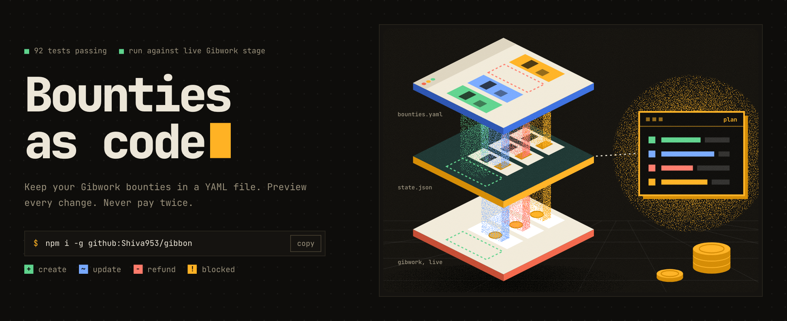
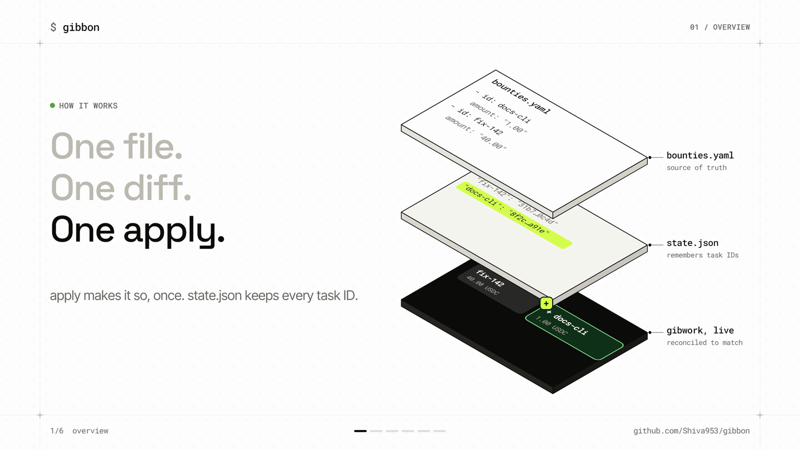
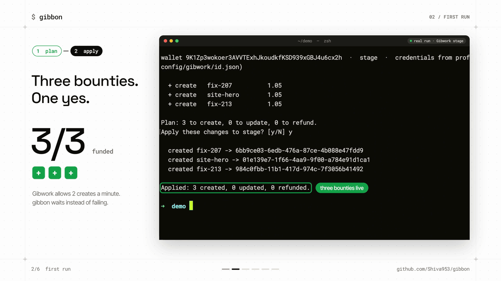
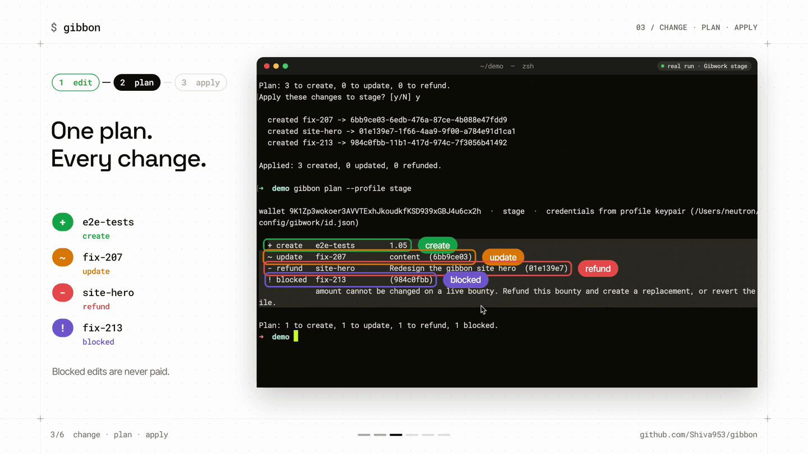
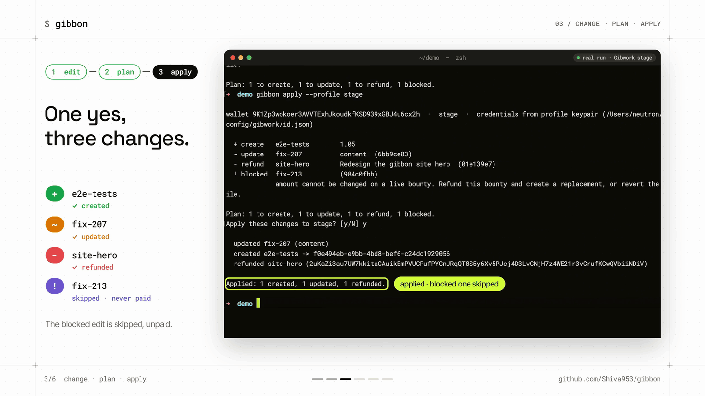
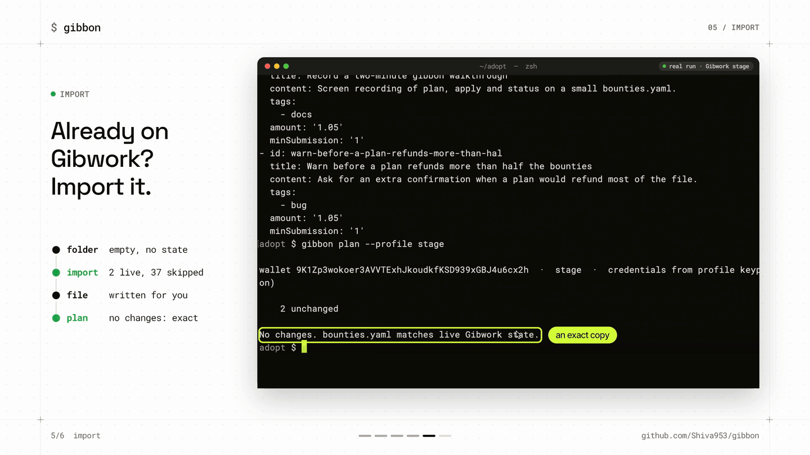
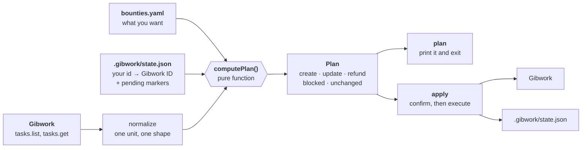
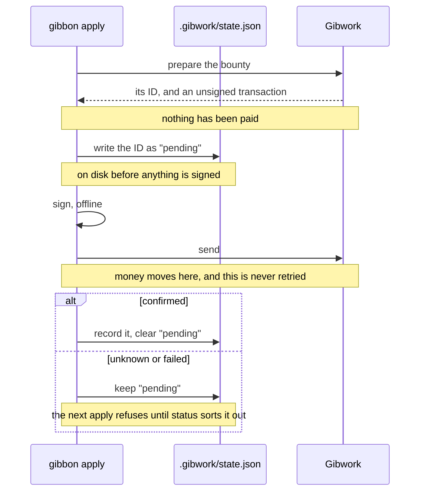
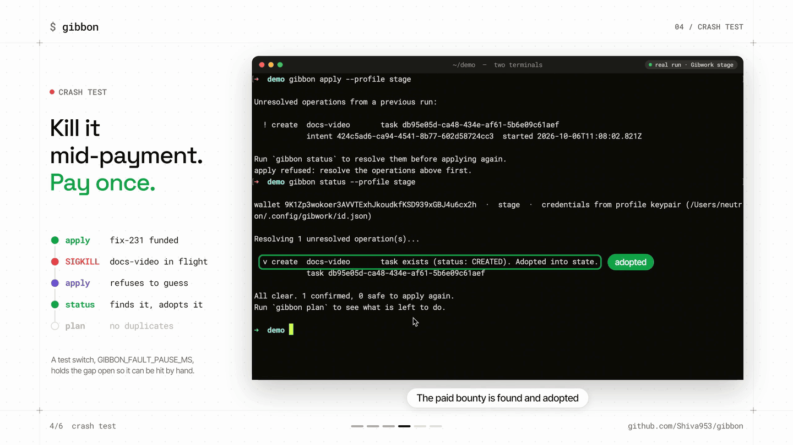

# Gibbon



**Bounties as code for Gibwork.**

Keep your bounty backlog in one YAML file, preview every change, and never pay twice.

**[Watch the demo](https://drive.google.com/file/d/1Ld6ab1CT0AdI5Eq7YtdY-96FvdrBph0b/view?usp=sharing)**  
**[Getting started](#getting-started)**  
**[How it works](#how-it-works)**  
**[Architecture](#architecture)**  
**[Cheat sheet](#cheat-sheet)**  
**[Landing page](https://gibbon-cli.vercel.app)**

---

Gibbon is for open source projects that fund their issue backlog on
[Gibwork](https://gib.work). You list the bounties you want in `bounties.yaml`,
next to your code. `gibbon plan` shows what would change on Gibwork.
`gibbon apply` makes it happen.

```
$ gibbon plan --profile stage

  + create   e2e-tests        1.05
  ~ update   fix-207          content  (6bb9ce03)
  - refund   site-hero        Redesign the gibbon site hero  (01e139e7)
  ! blocked  fix-213          (984c0fbb)
             amount cannot be changed on a live bounty. Refund this bounty and
             create a replacement, or revert the file.

Plan: 1 to create, 1 to update, 1 to refund, 1 blocked.
```

That was a preview. Nothing was paid. Gibbon is a terminal tool built on the
[Gibwork SDK](https://www.npmjs.com/package/@gibwork/sdk): no web app, no
dashboard.

## Contents

- [The problem](#the-problem)
- [Demo](#demo)
- [Status](#status)
- [How it works](#how-it-works)
- [Getting started](#getting-started)
- [What a normal Friday looks like](#what-a-normal-friday-looks-like)
- [But Gibwork already has an AI agent for this](#but-gibwork-already-has-an-ai-agent-for-this)
- [Already have bounties? Use import](#already-have-bounties-use-import)
- [Writing the file with AI](#writing-the-file-with-ai)
- [Architecture](#architecture)
- [Cheat sheet](#cheat-sheet)
- [What this uses from Gibwork](#what-this-uses-from-gibwork)
- [Using it in CI](#using-it-in-ci)
- [Working on Gibbon](#working-on-gibbon)
- [Where this could go](#where-this-could-go)

---


## The problem

With ten bounties live, every change means listing them, copying an ID, and
pasting it into the next command. An AI agent can do that typing. It cannot fix
these four things:


| Today                                                                                               | With Gibbon                                                                                              |
| --------------------------------------------------------------------------------------------------- | -------------------------------------------------------------------------------------------------------- |
| **No preview.** You run a command and find out afterwards.                                          | `gibbon plan` shows every change first, and changes nothing.                                             |
| **Running it twice pays twice.** Ask for a bounty twice and you fund two.                           | The file says what should exist, so a second `apply` does nothing.                                       |
| **No record of what you meant.** Weeks later nobody knows who changed a reward, or why.             | The list is a file in git. `git log` is the history, a pull request is the review.                       |
| **A crash mid-payment leaves you guessing.** Did the money move? Retrying can fund a second bounty. | Gibbon writes the bounty's ID to disk before it pays, so `gibbon status` can check what really happened. |


---


## Demo

**[Watch the demo (3:26)](https://drive.google.com/file/d/1Ld6ab1CT0AdI5Eq7YtdY-96FvdrBph0b/view?usp=sharing)**.
Every terminal in it is a real run against Gibwork stage, with real USDC, sped
up where marked.




| Time | What you see                                                           |
| ---- | ---------------------------------------------------------------------- |
| 0:00 | The problem: ten bounties, ten commands, one crash                     |
| 0:19 | First run: `plan` previews three bounties, one `apply` funds all three |
| 0:56 | A week of edits: one plan shows create, update, refund and blocked     |
| 1:56 | Crash test: `kill -9` mid-payment, and it still pays exactly once      |
| 2:50 | `import`: adopt bounties that are already on Gibwork                   |
| 3:16 | 100 tests, and how to install                                          |


The demo is cut from three screen recordings. Here they are uncut, so any
frame in the video or in this README can be checked against its source:

| Recording | Length | What it is |
| --- | --- | --- |
| [01-plan-apply.mp4](https://drive.google.com/file/d/19qeeaNgjDgp5M2HWiJ_u0n4kjhrEm9wm/view?usp=sharing) | 4:21 | The first run, then the week of edits: every `plan` and `apply` |
| [02-crash.mp4](https://drive.google.com/file/d/1M7YGSq0C_sJmBVWB1okwKuxg-lPdlSCX/view?usp=sharing) | 1:43 | The crash test: the kill mid-payment, then the recovery |
| [03-import.mp4](https://drive.google.com/file/d/1qDDacM0g4JSCbjnhNyOi_7rHp7SAi0Yw/view?usp=sharing) | 0:55 | `import` into an empty folder, then `plan` |

The screenshots below are frames from the video. All of them are in
[docs/screenshots/](docs/screenshots/).

---


## Status

All five commands work.

- `plan`, `apply`, `import` and `status` have been run against the live Gibwork
stage API. The demo shows each one.
- `agent` works, and needs an Anthropic API key.
- `--json` output and exit codes match the official CLI.
- 100 automated tests. None touch the network.

---


## How it works

Every `plan` compares three things:


|               | what it is                         | where it lives        |
| ------------- | ---------------------------------- | --------------------- |
| what you want | your bounty list                   | `bounties.yaml`       |
| what you made | your names mapped to Gibwork's IDs | `.gibwork/state.json` |
| what exists   | your live bounties                 | Gibwork               |


The middle one is why you never type an ID. You call a bounty `fix-207`,
Gibwork calls it `6bb9ce03-...`, and Gibbon remembers which is which.


| command  | what it does                                              | costs money          |
| -------- | --------------------------------------------------------- | -------------------- |
| `import` | Writes the file from bounties you already have. Run once. | no                   |
| `plan`   | Shows what would change. Changes nothing.                 | no                   |
| `apply`  | Makes the changes.                                        | **yes**              |
| `status` | Cleans up after an interrupted `apply`.                   | no                   |
| `agent`  | Rewrites the file from a plain English request.           | no (needs an AI key) |


---


## Getting started


### Get the CLI

Needs Node.js 22 or newer. You do not have to install anything globally: you
can run Gibbon straight from this repository.

**Run it from the repository**, with [Bun](https://bun.sh):

```bash
git clone https://github.com/Shiva953/gibbon
cd gibbon
bun install && bun run build

node dist/index.js plan --profile stage     # run it from the repo
alias gibbon="node $PWD/dist/index.js"      # optional: a short name for this shell
```

To skip the build step, Bun can run the source directly:
`bun run src/index.ts plan --profile stage`.

**Or install the `gibbon` command.** This also comes straight from GitHub, not
from the npm registry:

```bash
npm i -g github:Shiva953/gibbon
```

The rest of this README writes `gibbon`. From the repository, that is
`node dist/index.js`, or the alias above.

### Set up your wallet

If you already use the official Gibwork CLI, **you are done**. Gibbon reads the
same config:

```bash
gibbon plan --profile stage
```

Otherwise point it at a Solana keypair file with `GIBWORK_KEYPAIR_PATH`, or
pass `--keypair <path>`. A private key is never accepted as a command line
argument, and `.env` is never read on its own.

> **Stage is not free.** Gibwork's `stage` keeps test bounties out of the main
> marketplace, but it settles in **real mainnet USDC**. The minimum bounty is
> 1.00 USDC, and a create and refund cycle costs about a cent.


### Your first bounty

Create `bounties.yaml`:

```yaml
- id: proxy-env
  title: "Respect the HTTPS_PROXY variable"
  content: "<p>A reused session ignores HTTPS_PROXY. See issue #142.</p>"
  tags: [bug, python]
  amount: "1.00"
  minSubmission: "1.00"
```

Then preview and apply:

```
$ gibbon plan --profile stage
wallet 9K1Zp3wokoer3AVVTExhJkoudkfKSD939xGBJ4u6cx2h  ·  stage  ·  credentials from profile keypair

  + create   proxy-env        1.00

Plan: 1 to create, 0 to update, 0 to refund.

$ gibbon apply --profile stage
  + create   proxy-env        1.00
Apply these changes to stage? [y/N] y

  created proxy-env -> fcfb7a61-edd5-42f7-ad2e-59ae229bbac9

Applied: 1 created, 0 updated, 0 refunded.
```

Your bounty is live, and Gibbon wrote down which UUID it got:

```bash
$ cat .gibwork/state.json
{
  "version": 1,
  "wallet": "9K1Zp3wokoer3AVVTExhJkoudkfKSD939xGBJ4u6cx2h",
  "environment": "stage",
  "tasks": {
    "proxy-env": {
      "taskId": "fcfb7a61-edd5-42f7-ad2e-59ae229bbac9",
      "lastAppliedHash": "2011b853086adb6c",
      "lastSyncedAt": "2026-09-18T10:42:22.519Z"
    }
  },
  "pending": []
}
```

> Keep that file. It is the only thing connecting `proxy-env` to that UUID.
> Delete it and Gibbon forgets the bounty exists, with your money still in
> escrow.

For one bounty the official CLI is just as good: `gibwork task create` with six
flags is the same length as the YAML. The difference starts at the second
bounty, and at the second time you run anything.

The demo's first run does the same with three bounties and one confirmation:



Uncut recording of this run: [01-plan-apply.mp4](https://drive.google.com/file/d/19qeeaNgjDgp5M2HWiJ_u0n4kjhrEm9wm/view?usp=sharing) (4:21).

---

## What a normal Friday looks like

You have five bounties live. One got fixed upstream, two need clearer
descriptions, and a new bug needs funding.

### With the official CLI

First find out what you have, then copy a UUID out of the list for each change:

```
$ gibwork task list --profile stage --limit 5
ID                                    STATUS       OPEN   TITLE
fcfb7a61-edd5-42f7-ad2e-59ae229bbac9  in progress  true   Connection leak on streamed responses
7b2e1f04-9c31-4a8d-b6e2-1f0a5c8d3e44  in progress  true   Rewrite the quickstart guide
3d5f8a10-4b2c-49e7-8f31-0c7a9e6b2d55  in progress  true   Clearer timeout error messages
9c04ab13-2e77-4b10-a3f5-6d8e0b2c1a99  in progress  true   Jittered retry backoff
b8e07c94-1a6d-4f52-9e88-2c4b7d0a3f61  in progress  true   Persist the cookie jar across sessions

$ gibwork task refund fcfb7a61-edd5-42f7-ad2e-59ae229bbac9 --profile stage
$ gibwork task update 7b2e1f04-9c31-4a8d-b6e2-1f0a5c8d3e44 --profile stage --content-file docs.html
$ gibwork task update 3d5f8a10-4b2c-49e7-8f31-0c7a9e6b2d55 --profile stage --content-file timeout.html
$ gibwork task create --profile stage \
    --title "HTTP/2 ALPN negotiation fails on macOS" \
    --content-file alpn.html --tag bug --tag macos \
    --amount 1.00 --min-submission 1.00
```

Four commands, four confirmations, **three UUIDs copied by hand**, and no
preview.
Paste the wrong UUID into a refund and you close a bounty somebody is actively
working on. Nothing warns you.

### With Gibbon

Edit one file: delete one entry, change two `content:` lines, add one.

```diff
$ git diff bounties.yaml
-- id: stream-leak
-  title: "Connection leak on streamed responses"
-  content: "<p>Streamed responses never release their socket.</p>"
-  tags: [bug, python]
-  amount: "1.00"
-
 - id: docs-quickstart
-  content: "<p>The quickstart is out of date.</p>"
+  content: "<p>The quickstart is out of date. Cover install, first request and auth.</p>"
+
+- id: http2-alpn
+  title: "HTTP/2 ALPN negotiation fails on macOS"
+  content: "<p>ALPN falls back to HTTP/1.1 on macOS only. See #211.</p>"
+  tags: [bug, macos]
+  amount: "1.00"
```

```
$ gibbon plan --profile stage
  + create   http2-alpn       1.00
  ~ update   docs-quickstart  content  (7b2e1f04)
  ~ update   timeout-msg      content  (3d5f8a10)
  - refund   stream-leak      Connection leak on streamed responses  (fcfb7a61)
    2 unchanged

Plan: 1 to create, 2 to update, 1 to refund.

$ gibbon apply --profile stage
Apply these changes to stage? [y/N] y
```

**One screen showing everything that will happen, before any of it happens.**
One confirmation instead of four. No UUID typed at any point. The short hashes
in brackets are output you can cross-check, not input you have to get right.
And because it is a `git diff`, a teammate can review a bounty change in a pull
request before it spends money.

**The part that is not about convenience:** run the CLI block twice and you get
a second "HTTP/2 ALPN negotiation fails on macOS" bounty and another 1.00 USDC
gone.
Run `apply` twice and the second run prints:

```
    5 unchanged

No changes. bounties.yaml matches live Gibwork state.
```

A command is an instruction, so it runs every time. A file describes how things
should be, so running it twice is the same as running it once.

In the demo, the same loop runs for real: one plan shows all four kinds of
change, and one confirmation applies them.





Uncut recording of both screens: [01-plan-apply.mp4](https://drive.google.com/file/d/19qeeaNgjDgp5M2HWiJ_u0n4kjhrEm9wm/view?usp=sharing) (4:21).

---

## But Gibwork already has an AI agent for this

It does, and for a single bounty it is better than this. Say "create a bounty
for the parser leak at 1 USDC" and it happens. Gibbon is for what comes after.
You can run each of these yourself.

| Situation | The agent | Gibbon |
| --- | --- | --- |
| You ask for the same bounty twice | Two bounties, paid twice, no warning | The second `apply` says `No changes.` |
| A teammate edits a bounty in the app | Can read it to you, cannot tell it changed | `plan` shows the edit as a difference |
| You raise a live bounty's reward | Fails partway, or refunds and recreates without asking | `! blocked`, with the reason. Nothing is paid |
| The session dies mid-payment | No record. Retrying pays twice | `apply` refuses, `status` finds the paid bounty |

### 1. Doing the same thing twice

```
$ gibbon apply --profile stage
$ gibbon apply --profile stage
    5 unchanged

No changes. bounties.yaml matches live Gibwork state.
```

Ask the agent for the same bounty on Monday and again on Friday, and you get
two bounties and 2 USDC locked.

### 2. Asking whether anything changed without you

Someone edits a bounty in the Gibwork app. Nothing on your machine records what
it used to say, except the file:

```bash
gibbon plan --profile stage     # free. shows the edit as "~ update"
git log -p bounties.yaml        # when the file last changed, by whom, and why
```

### 3. Raising a reward

Gibwork does not allow it: a live bounty's amount is permanent. The official
CLI only says:

```
$ gibwork task update bb24ca91-1b4f-4d91-8fa3-fed2501972f4 --profile stage --amount 5.00
error: unknown option '--amount'
```

With the file, change `amount: "1.00"` to `"5.00"`:

```
$ gibbon plan --profile stage
  ! blocked  parser-leak      (bb24ca91)
             amount cannot be changed on a live bounty. Refund this bounty and
             create a replacement, or revert the file.

Plan: 0 to create, 0 to update, 0 to refund, 1 blocked.
```

Exit code 30. Nothing was written to Gibwork. It names the limit, gives you the
options, and does not pick one for you.

### 4. The session dying halfway through

Gibbon writes the new bounty's ID to disk **before** it pays:

```
1. ask Gibwork to prepare the bounty      (nothing has been paid yet)
2. write the ID to .gibwork/state.json     <-- the important bit
3. sign the transaction                    (still offline)
4. send it                                 (money moves here)
5. mark it done
```

Kill it anywhere after step 2 and the next run can ask Gibwork what happened.
This is the demo's run, where `kill -9` landed after the payment went through:

```
$ gibbon apply --profile stage

Unresolved operations from a previous run:

  ! create  docs-video       task db95e05d-ca48-434e-af61-5b6e09c61aef
            intent 424c5ad6-ca94-4541-8b77-602d58724cc3  started 2026-10-06T11:08:02.821Z

Run `gibbon status` to resolve them before applying again.
apply refused: resolve the operations above first.        # exit 31

$ gibbon status --profile stage
Resolving 1 unresolved operation(s)...

  v create  docs-video       task exists (status: CREATED). Adopted into state.
            task db95e05d-ca48-434e-af61-5b6e09c61aef

All clear. 1 confirmed, 0 safe to apply again.

$ gibbon plan --profile stage
    2 unchanged

No changes. bounties.yaml matches live Gibwork state.
```

One crash, paid exactly once. The uncut recording is
[02-crash.mp4](https://drive.google.com/file/d/1M7YGSq0C_sJmBVWB1okwKuxg-lPdlSCX/view?usp=sharing) (1:43). To reproduce it, see
[Crash-testing it yourself](#crash-testing-it-yourself).

### So when is each one right?

Use the **Gibwork app or agent** to post one bounty now, or one that needs
images. Use **Gibbon** when the same bounties live for months, more than one
person changes them, or it has to run unattended. Most projects will use both.

---

## Already have bounties? Use import

If you posted bounties through the Gibwork app or CLI, run `gibbon import`
once. It writes `bounties.yaml` and the state file from what is live, then
checks its own work: if the file does not match live state exactly, it writes
nothing.

```
$ gibbon import --profile stage

wallet 9K1Zp3wokoer3AVVTExhJkoudkfKSD939xGBJ4u6cx2h  ·  stage

Reading live tasks...
  record-a-two-minute-gibbon-walkthrough       1.05  (db95e05d)
  warn-before-a-plan-refunds-more-than-hal       1.05  (c1eb05cd)

Imported 2 bounty(s) into bounties.yaml, skipped 37 not open or not editable by this wallet.
Verified: the generated file reports zero changes against live state.

$ gibbon plan --profile stage
    2 unchanged

No changes. bounties.yaml matches live Gibwork state.
```



Uncut recording: [03-import.mp4](https://drive.google.com/file/d/1qDDacM0g4JSCbjnhNyOi_7rHp7SAi0Yw/view?usp=sharing) (0:55).

> **Do not skip this.** A hand-written file has no link to the bounties you
> already have, so `apply` would create every one of them again, with real
> money.

---


## Writing the file with AI

```bash
export ANTHROPIC_API_KEY=sk-ant-...
gibbon agent "add a bounty for the flaky test in #88 at 2 USDC, and close the docs one" --dry-run
```

`agent` edits the file and stops. It never talks to Gibwork and never sees your
wallet, so you still read the diff and run `plan` and `apply` yourself. It
knows the rules, and says so when a request cannot be done:

```
Not applied:
  ! change the reward on fix-142 to 7
    amount is immutable on a live bounty. Refund it and create a replacement.
```

Whatever the model writes is checked by the same parser `plan` uses. A made-up
ID gives you a file that fails to load, not a refunded bounty.

---


## Architecture

TypeScript in `src/`, built on `@gibwork/sdk`. Two rules shape it: **every
decision that can move money is made in one place, and nothing is paid until
the tool can recover from being killed.**

### The shape of a run




`plan` prints the plan. `apply` recomputes it, asks, then runs it, so the plan
you confirm is the plan that runs.

### The decision table

`computePlan()` has no network, no clock and no disk, so every rule is tested
directly. These are all of them:


| In the file | Tracked | On Gibwork                                                   | Result          |
| ----------- | ------- | ------------------------------------------------------------ | --------------- |
| yes         | no      | anything                                                     | **create**      |
| yes         | yes     | identical                                                    | unchanged       |
| yes         | yes     | `content`, `deadline` or verified-only differs               | **update**      |
| yes         | yes     | `title`, `tags`, `amount`, `mint` or `minSubmission` differs | **blocked**     |
| yes         | yes     | missing, closed or refunded                                  | **blocked**     |
| no          | yes     | open and refundable                                          | **refund**      |
| no          | yes     | open, but not refundable right now                           | **blocked**     |
| no          | yes     | already closed                                               | dropped quietly |
| no          | no      | live, posted some other way                                  | ignored         |


The last row is what makes Gibbon safe on a wallet that already has bounties:
it never touches one it did not record.

### How `apply` moves money

Updates run first, because they cost nothing. Then each create or refund goes
through the same steps:




The order is the whole point. Gibwork has no way to mark a create as "the same
request as before", so a retry would fund a second bounty. Writing the ID down
first means a killed run can always be checked instead of repeated.

### Recovery

`gibbon status` asks Gibwork about every pending operation:


| Interrupted | Gibwork says             | What happens                             |
| ----------- | ------------------------ | ---------------------------------------- |
| create      | not found                | it never happened. Safe to apply again   |
| create      | still creating           | **stays blocked**. Try again in a minute |
| create      | exists                   | adopted. You are done                    |
| create      | refunded                 | safe to apply again                      |
| refund      | gone, refunded or closed | it worked                                |
| refund      | still open               | it never happened. Safe to apply again   |


"Still creating" is the only answer that keeps blocking, because it is the only
moment a retry could pay twice.

### Crash-testing it yourself

The gap between a payment landing and Gibbon recording it lasts a fraction of a
second. `GIBBON_FAULT_PAUSE_MS` holds it open so you can hit it by hand:

```bash
GIBBON_FAULT_PAUSE_MS=8000 gibbon apply -y
# in a second terminal, during "… fault pause 8s":
kill -9 $(pgrep -f "gibbon apply")

gibbon apply     # refuses: an operation is unresolved
gibbon status    # v create … Adopted into state.
gibbon plan      # No changes.
```



In the demo the kill lands after the payment and before it is recorded. `apply`
[refuses to guess](docs/screenshots/demo-crash-refused.png), `status` adopts
the bounty, and `plan` reports
[no changes](docs/screenshots/demo-crash-paid-once.png): paid exactly once.
Uncut recording: [02-crash.mp4](https://drive.google.com/file/d/1M7YGSq0C_sJmBVWB1okwKuxg-lPdlSCX/view?usp=sharing) (1:43).

The switch is off unless set, capped at 60 seconds, and `apply` warns whenever
it is on.

### Module map

Which file does what


| File                                    | Job                                                            |
| --------------------------------------- | -------------------------------------------------------------- |
| `src/index.ts`, `sync.ts`, `runtime.ts` | The CLI: flags, the five commands, wallet and profile loading  |
| `src/lib/yaml.ts`                       | Reads and checks `bounties.yaml`                               |
| `src/lib/state.ts`                      | Reads and writes `.gibwork/state.json`, never half-written     |
| `src/lib/live.ts`, `normalize.ts`       | Fetches live bounties and puts them in the file's shape        |
| `src/lib/diff.ts`                       | `computePlan()`: decides what changes                          |
| `src/lib/executor.ts`, `pacer.ts`       | Makes the changes, one at a time, inside Gibwork's rate limits |
| `src/lib/resolve.ts`                    | Works out what happened to an interrupted payment              |
| `src/lib/llm.ts`                        | The `agent` command                                            |


### Rules the code does not break

- **One function decides.** Everything that can move money goes through `computePlan()`.
- **Disk before payment.** The pending ID is saved before anything is signed. A test proves the order.
- **A payment is never retried.** An unknown result goes to `status`.
- **It waits instead of failing.** Gibwork allows two creates a minute per wallet, so `apply` paces itself.
- **The AI never holds a wallet.** `agent` cannot reach Gibwork, even by mistake.
- **Money is never rounded.** Unquoted `1.00` in YAML is the number `1`, so the file is rejected.

---


## Cheat sheet


### Commands

```
gibbon plan    [-f <file>]                 preview changes
gibbon apply   [-f <file>] [-y]            make changes
gibbon import  [-f <file>] [--force]       build the file from live bounties
gibbon status  [-f <file>] [--dry-run]     fix an interrupted apply
gibbon agent   "<request>" [--dry-run]     edit the file with AI

Options on every command:
--profile <name>          use a profile from the Gibwork config
--environment <env>       stage or production
--keypair <path>          path to a keypair file
--private-key-stdin       read the key from a pipe
--json                    machine readable output
--quiet                   less printing
```


### Exit codes

The same as the official Gibwork CLI, so a script can treat both alike.


| code | meaning                                                 |
| ---- | ------------------------------------------------------- |
| 0    | done, or nothing to do                                  |
| 2    | bad flag, or a mistake in `bounties.yaml`               |
| 10   | wallet or config problem                                |
| 20   | Gibwork returned an error                               |
| 21   | network problem or timeout                              |
| 22   | a payment result is unknown. Run `status`, do not retry |
| 30   | some changes are impossible                             |
| 31   | an interrupted operation needs `status`                 |
| 130  | you pressed Ctrl-C                                      |


### The file format

```yaml
- id: fix-142                 # your name for it. never changes. never sent to Gibwork
  issue: "#142"               # optional note for you
  title: "Fix memory leak"    # cannot change after the bounty is live
  content: "<p>HTML here</p>" # can change
  tags: [bug, rust]           # cannot change after the bounty is live
  amount: "1.00"              # cannot change. must be quoted. 1.00 to 100000.00
  minSubmission: "1.00"       # optional. defaults to the full amount
  deadline: "2026-10-01T12:00:00.000Z"   # optional. can change
  allowOnlyVerifiedSubmissions: false    # optional. can change
```

- **Quote the amount.** Unquoted `1.00` becomes the number `1`. Gibbon refuses to load it.
- **Never rename an** `id` **after applying.** Gibbon reads that as "refund the old bounty, create a new one".

---


## What this uses from Gibwork

Built entirely on the **Gibwork SDK** (`@gibwork/sdk`). No CLI wrapping, no
scraping.


| what it does        | SDK call                                                                     |
| ------------------- | ---------------------------------------------------------------------------- |
| read your bounties  | `tasks.list()`, `tasks.get(taskId)`                                          |
| create a bounty     | `tasks.prepareCreate()`, `signPreparedTransaction()`, `tasks.submitCreate()` |
| edit a bounty       | `tasks.update(taskId, input)`                                                |
| close a bounty      | `tasks.prepareRefund()`, `tasks.submitRefund()`                              |
| sign as your wallet | `createKeypairSigner()`, `new GibworkClient()`                               |


Creating in two calls is deliberate. The one-call `tasks.create()` only returns
after the money has moved. The split version hands back the ID first, which is
what makes crash recovery possible.

Three things we learned from the live API, all handled in the code:

- `asset.amount` comes back in base units as a string (`"1000000"` for 1 USDC),
while `minSubmissionAmount` on the same object is whole tokens as a number.
- Gibwork sets a deadline even if you do not ask for one, so fields you leave
out of the file are left alone.
- A reward must be between 1.00 and 100000.00.


### What this does not do

- **No images.** Bounties that need screenshots belong in the Gibwork app.
- **No submissions.** Reviewing and paying people happens in the app or the official CLI.
- **Not worth it for one bounty.** This is for a set of bounties over time.

---


## Using it in CI

Preview on every pull request, apply on merge.

The workflow file

```yaml
name: bounties
on:
  pull_request:
    paths: ['bounties.yaml']
  push:
    branches: [main]
    paths: ['bounties.yaml']

concurrency:
  group: bounties-${{ github.ref }}   # two applies at once creates duplicates
  cancel-in-progress: false

jobs:
  plan:
    if: github.event_name == 'pull_request'
    runs-on: ubuntu-latest
    steps:
      - uses: actions/checkout@v4
      - run: npm i -g github:Shiva953/gibbon
      - env: { GIBWORK_PRIVATE_KEY: "${{ secrets.GIBWORK_PRIVATE_KEY }}" }
        run: gibbon plan --environment ${{ vars.GIBWORK_ENV }}

  apply:
    if: github.event_name == 'push'
    runs-on: ubuntu-latest
    environment: gibwork        # add a required reviewer to this environment
    steps:
      - uses: actions/checkout@v4
      - run: npm i -g github:Shiva953/gibbon
      - env: { GIBWORK_PRIVATE_KEY: "${{ secrets.GIBWORK_PRIVATE_KEY }}" }
        run: |
          gibbon status --environment ${{ vars.GIBWORK_ENV }}
          gibbon apply --yes --environment ${{ vars.GIBWORK_ENV }}
      - run: |      # commit the state file back, see below
          git config user.name github-actions
          git config user.email github-actions@github.com
          git add -f .gibwork/state.json
          git commit -m "chore: sync bounty state" || true
          git push
```


Two things are not optional:

- **The state file must survive between runs.** A fresh checkout without it
calls every bounty new and creates them all again. Nothing in it is secret.
- **Put** `apply` **behind a required reviewer.** A merge should not be able to
spend from your wallet on its own.

---


## Working on Gibbon

```bash
bun install && bun run typecheck && bun run test && bun run build
```

100 tests cover the plan rules, the file parser, the state file, crash recovery
and the import round trip. None touch the network or spend anything. A separate
live suite does spend money, and is opt in: `GIBWORK_LIVE_TEST=1 bun test test/live`.

The landing page, [gibbon-cli.vercel.app](https://gibbon-cli.vercel.app), is a
Next.js app in [site/](site/). Run it with `bun run site`.

---


## Where this could go

Gibbon is a separate CLI on purpose. The official `gibwork` CLI runs one
command per bounty; Gibbon works from a file and keeps local state, so merging
them would change what the existing commands mean.

It is built to be absorbed, though. It calls the SDK directly, reads the same
profiles, and uses the same exit codes, so its five commands would drop in as
`gibwork sync plan` and `gibwork sync apply`. The one thing the platform would
need is a way to mark a create request so that sending it twice makes one
bounty (an idempotency key). Everything in `status` exists to work around not
having it.

---


## License

[MIT](LICENSE). Gibbon is a community tool built for the Gibwork Developer
Hackathon. It is not an official Gibwork product.